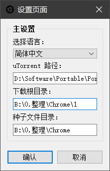

# [English](https://github.com/hxz393/UTAdder/blob/main/README_EN.md) | [中文](https://github.com/hxz393/UTAdder/blob/main/README.md)

# 程序介绍

「UTAdder」是一款 [uTorrent](utorrent.com) 软件辅助程序，用于跳过 GUI，快速批量添加种子文件，从而节省大量重复操作时间。

程序截图：


## 下载地址

提供两种下载方式：

- 方式一：访问 [release 页面](https://github.com/hxz393/UTAdder/releases) 下载最新版本的可执行文件，下完可直接打开使用。
- 方式二：通过[百度网盘](https://pan.baidu.com/s/1RK7uBqaqgqJHLJbadXI48g?pwd=6666)下载相应的压缩包，下载后请先解压再使用。

## 自行打包

开发环境为 Win10，使用 Python 版本 3.10，依赖只有 PyQT5，本地调试可以通过 `pip install` 命令安装。

打包命令：

```python
pyinstaller -F -w -i media/main.ico --add-data 'media/;media' UTAdder.py
```

## 模块说明

和我其他项目结构差不多：

- `UTTAdder.py`：程序主入口文件。
- `config/`：配置目录，包含语言字典和全局变量。
- `doc/`：文档相关目录。
- `lib/`：实用功能库，存放功能函数。
- `media/`：媒体文件目录，存放图标资源。
- `ui/`：和界面操作相关的模块。

该项目没有使用 `Designer` 设计界面，也没有采用 `Linguist` 做本地化，因此没有相应的原始文件。

## 开源许可

本程序采用 [GPL-3.0 license](https://github.com/hxz393/UTAdder/blob/master/LICENSE) 许可证，对于违反开源社区基本规则、私自将开源项目用于商业目的的行为，属于侵权，开发者将追究相关法律责任。


# 程序使用

本程序无需安装，全部打包成一个可执行文件，可随意移动拷贝后运行。运行后，仅生成一个配置文件目录。

## 基本设置

打开程序后，点击「设置」按钮进行基本设置：



各设置说明如下：

- **选择语言**：默认为英语，可以点选下拉框设置成中文。
- **uTorrent 路径**：uTorrent 程序路径，必须是完整路径。例如：`D:\Software\uTorrent\utorrent.exe`，根据实际情况修改。
- **下载根目录**：指下载内容存放路径，一般对应到 uTorrent 中「设置」-「目录」-「将新下载放置到」填入的路径。叫根目录是因为还可以在下面建立自定义子目录，通过程序主界面「保存目录」来指定，用于下载内容分类。
- **种子文件目录**：程序从这个目录中搜索要添加的种子文件。注意，不会进入到子目录中搜索，种子必须直接在这个文件夹下面。

点击确认来保存修改，配置内容会保存到 `config/config.json` 文件中。

## 批量添加

批量添加种子到 uTorrent 是程序主要功能，按照程序逻辑来说有三点：

- **保存目录**：如果没有整理下载文件习惯，那这个程序基本用不到，只需要拖动多个种子文件到 uTorrent 窗体，即可实现批量添加任务。但如果经常下载，需要在下载时就设置好指定目录，那么可以使用本程序快速完成添加。例如在设置中下载根目录为 `D:\Download`，保存目录填入 `ABBA`，最终任务的下载目录为 `D:\Download\ABBA`。在完成批量添加任务后，保存目录输入框会自动清空，等待你下次指定，可能是 `AC-DC` 或是别的。勾选输入框后面的勾，则会保留种子名作为新一级子目录。
- **添加任务**：点击「添加」按钮后，程序会自动将指定目录下的所有种子添加到 uTorrent 中。添加速度没有程序显示的那么快，有延迟但还没碰到过失败，比在界面中一个个任务处理要快多了。完成以后，在程序窗口右下角会显示添加任务总数，或是报错信息？
- **处理种子**：添加到下载后，按理说种子文件没用了，可以直接删除。但由于延迟存在，会出现任务还没添加完成（uTorrent 假死），种子文件先被删除，导致添加失败的情况。所以现在使用种子文件目录下的「added」文件夹，来收集已添加到任务的种子文件。

至于其他功能，你应该看得出来，我想让程序尽可能简单，这样你能在自己的分支上随意修改。


# 常见问题

可以通过添加按钮旁边的「?」快速跳转到项目主页，到 Issues 中反馈问题和功能建议，每条我都会认真处理。

## 自动加标签功能

很遗憾，实现不了。我平时也使用标签，但当前版本不支持在命令行中指定任务标签。如果有新版本可以加标签，请提醒我升级。

## 自动弹出窗口

在添加完任务后，必定会弹出 uTorrent 主窗口。当前版本没有静默添加参数（或是假的），我认为这是个 Bug 而不是特性，目前就当是多一道人工检查环节吧。


# 更新日志

更新没有规律，估计小版本号都用不上。

## 版本 1.1.0（2024.12.31）

更新内容：

1. 新增保留种名作为任务目录选项。

## 版本 1.0.0（2024.12.19）

发布第一个版本。