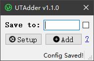
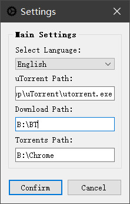

# [English](https://github.com/hxz393/UTAdder/blob/main/doc/README_EN.md) | [中文](https://github.com/hxz393/UTAdder/blob/main/README.md)

# Introduction

**UTAdder** is a companion tool for [uTorrent](https://utorrent.com/) designed to bypass its GUI when adding multiple torrent files. It saves you a lot of repetitive steps and streamlines the process.

Screenshot:



## Download

Please visit the [Releases Page](https://github.com/hxz393/UTAdder/releases) and download the latest executable. When downloaded, you can run it immediately without installation.

## Packaging by Yourself

The development environment is Windows 10 with Python 3.10. The only dependency is PyQt5, which can be installed via `pip install`.

You can package the application using the following command:

```python
pyinstaller -F -w -i media/main.ico --add-data 'media/;media' UTAdder.py
```

## Directory Structure

The structure is similar to my other projects:

- `UTAdder.py`: The main entry point of the program.
- `config/`: Configuration files, including language dictionaries and global variables.
- `doc/`: Documentation files.
- `lib/`: Utility functions.
- `media/`: Media assets such as icons.
- `ui/`: UI-related modules.

This project does not use `Designer` for UI design or `Linguist` for localization. Hence, there are no corresponding raw files for these tools.

## License

UTAdder is released under the [GPL-3.0 license](https://github.com/hxz393/UTAdder/blob/master/LICENSE). Unauthorized commercial use of this open-source project is considered an infringement of intellectual property rights. The developer reserves the right to take legal action against such violations.

------

# How to Use

UTAdder is distributed as a single executable, without installation required. You can move or copy it anywhere and run it. After running, it will only create a single configuration directory.

## Basic Settings

When you open the program, click the **Setup** button to configure the settings:



The settings include:

- **Select Language**: Default is English. You can switch to Chinese via the dropdown menu.
- **uTorrent Path**: Specify the full path to the uTorrent executable, e.g., `D:\Software\uTorrent\utorrent.exe`.
- **Download Path**: This is the base directory for all downloaded content. It typically matches what you've set in uTorrent under "Preferences" → "Directories" → "Put new downloads in:". We call it the root directory because you can add a custom subfolder later using the main window's "Save to" field to organize downloads.
- **Torrents Path**: UTAdder will look for `.torrent` files in this directory. Note that it does not search subfolders; the torrent files must be placed directly inside this folder.

Click "Confirm" to save your changes. The configuration will be stored in `config/config.json`.

## Adding Torrents in Bulk

The primary feature of UTAdder is to quickly add multiple torrent files into uTorrent in one go. Here's how it works:

- **Save to**: If you don't care about organizing your downloads, you could simply drag and drop multiple torrents into uTorrent. But if you regularly categorize downloads as soon as you add them, UTAdder helps. For example, if your root download directory is `D:\Download` and you set the save directory to `ABBA`, the completed download path becomes `D:\Download\ABBA`. After bulk adding, UTAdder clears the save to field, so you can immediately set a different directory for your next batch (e.g., `AC-DC`).
- **Adding Tasks**: After you specify the directories, click "Add" to import all torrents from the configured torrent files folder into uTorrent. The speed might not look instantaneous, but it's still much faster than adding them one by one through the GUI. When it's done, the bottom-right corner of window will show the total number of added tasks or display any error messages.
- **Handling Torrent Files**: After adding them, the original torrent files could be deleted. However, because there might be a slight delay before uTorrent fully processes them, deleting these files too soon can cause problems. To avoid this, UTAdder automatically moves successfully added torrents into an `added` subfolder within the torrent files directory, ensuring that nothing gets removed prematurely.

Overall, the program aims to be as simple as possible, letting you easily customize or enhance it for your own needs.

------

# Frequently Asked Questions

If you encounter issues or have suggestions, click the "?" button next to the Add button in the main window. It will open the project's homepage on GitHub, where you can post issues and feature requests. Each one will be reviewed and addressed.

## Automatic Labeling

Unfortunately, this feature isn't currently possible. I personally use labels too, but the current version of uTorrent does not support adding labels via command line. If a future update enables this, please let me know so I can implement it.

## Automatic Window Pop-Up

After adding tasks, uTorrent's main window will always pop up. There's no working silent mode option at present, and I consider this behavior a bug rather than a feature. For now, think of it as an extra step to ensure everything's been added correctly.

------

# Changelog

Updates are irregular; I might not even use small version increments.

## Version 1.0.0 (2024-12-19)

- First public release.